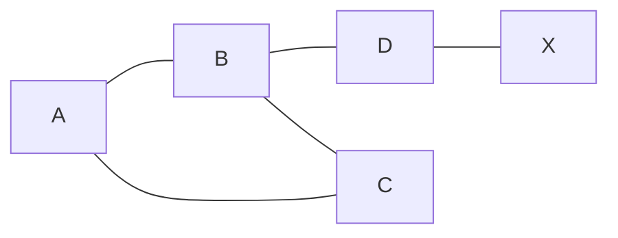
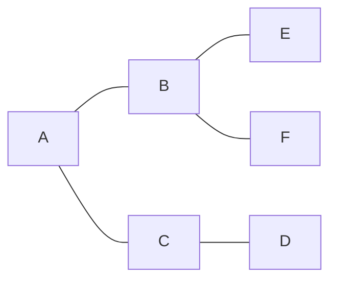
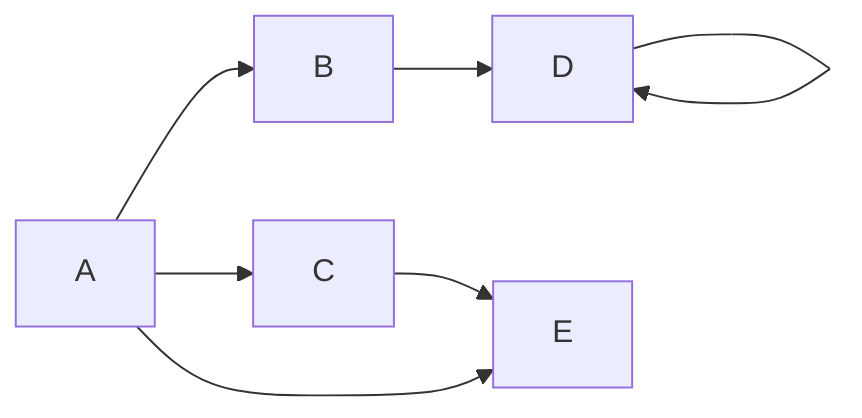

# Cyclic and Acyclic [[graphs]]

## Captures
We have directed and undirected [[graphs]] and these graphs could also be cyclic or acyclic graphs. 

*Cyclic:* [[graphs]] that have at least one single cycle i.e edges that allow traversal of the nodes in a circular fashion. 

*Acyclic:* [[graphs]] that have no cycles at all i.e the edges don't allow traversal of the nodes in a circular fashion.

Self-loops can only occur in directed [[graphs]] and they are considered cyclic because it forms a cycle with itself. 

Since directed graphs are very important and most of the data in this world are mostly directed. We have much importance in:
1. Directed Cyclic Graphs
2. Directed Acyclic Graphs (DAG) *
 
---
## Related Notes

## References(links)
