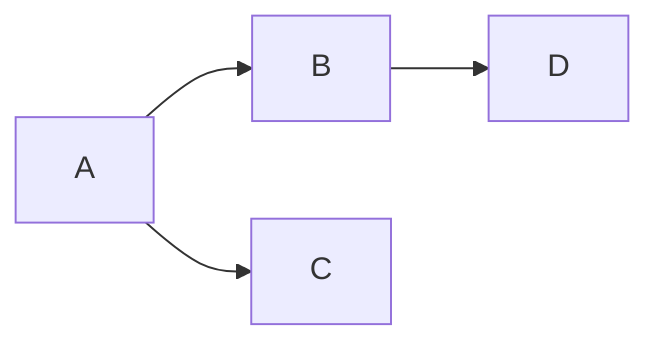

# dependency graphs

Dependency [[graphs]] are essentially [[directed acyclic graphs]] that helps resolve dependencies for any package. Package managers like `npm` or `yarn` use [[directed acyclic graphs]] for resolving their dependencies. 

Dependency [[graphs]] can be confusing but with the below example it is easy to understand. 

From the above graph, we can say that:

> A is dependent on B and C. B is dependent on D. 

The above statement might seem confusing if you take the literal meaning of the directed edges. But what this means in [[dependency graphs]] is that before we install the dependency `A`, dependencies `B` and `C` must be installed and before we install the dependency `B`, dependency `D` must be installed. 

This ultimately resolves dependency issues. 

*Q:* If we do [[topological sorting]] on a dependency graph we essentially get the reverse order in which we have resolve the dependencies. Is that right? Why is it that way? 
*A:*

---
## Related Notes
[[directed acyclic graphs]]
[[graphs]]
[[topological sorting]]

## References(links)
[Spinning Around In Cycles With Directed Acyclic Graphs | by Vaidehi Joshi | basecs | Medium](https://medium.com/basecs/spinning-around-in-cycles-with-directed-acyclic-graphs-a233496d4688)