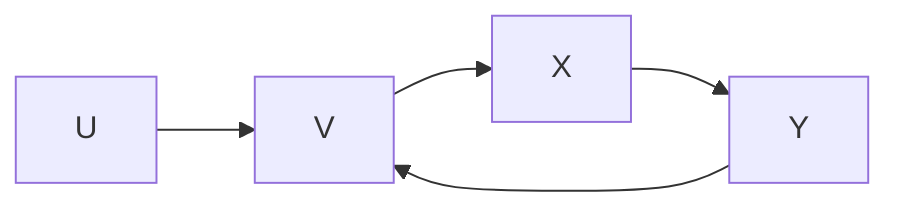

# DFS and Cycles 

## Captures
We are aware of [[cyclic and acyclic graphs]] and they play an important role when we are traversing [[graphs]]. 

The [[Recursion]] working of [[graphs depth first search]], makes it a powerful tool to detect cycles. 

*Why is that?* 
We know from [[types of graph edges]] that back edges occur when a node in a tree path links to one of its ancestors. And back edges are essentially edges that form a cycle in [[graphs]].

Since [[graphs depth first search]] maintains a [[Stack]] as it follows a path, if at any level there is a node that links to a node that is already in the stack (essentially in the path) then we know this link forms a cycle.

![[dfs-cycle.excalidraw.png]]

From the above diagram of the stack we can see how [[graphs depth first search]] detects cycle. It's innate nature of following a path in [[Recursion]] makes it efficient to detect back edges, which are the edges that form a cycle. 

---
## Related Notes
[[graphs depth first search]]
[[types of graph edges]]
[[graphs]]
[[Recursion]]
[[Stack]]

## References(links)
[Spinning Around In Cycles With Directed Acyclic Graphs | by Vaidehi Joshi | basecs | Medium](https://medium.com/basecs/spinning-around-in-cycles-with-directed-acyclic-graphs-a233496d4688)