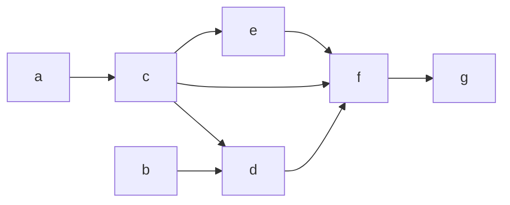

# DAG

DAG stands for `Directed Acyclic Graphs`, as the name suggests these are a type of graph that has directed edges and doesn't contain any cycles. 

If you've noticed in the above [[graphs]], the nodes have some kind of ordering. And this ordering is the reason why `DAGs` are famous and pretty common. 

They have many use cases:
1. Scheduling tasks which need to be processed in an order. 
2. To represent state machines for objects that don't have reversible states. 
3. [[dependency graphs]] are `DAGs` 

Since [[directed acyclic graphs]] have a specific ordering, this means we need an algorithm to sort through and order the nodes. This is where [[topological sorting]] comes. 

[[trees]] are naturally [[directed acyclic graphs]] since they don't have cycles and are actually undirected (but in perspective of CS it is considered directed).

---
## Related Notes
[[graphs]]
[[trees]]
[[graphs depth first search]]
[[cyclic and acyclic graphs]]
[[topological sorting]]
[[dependency graphs]]

## References(links)
[Spinning Around In Cycles With Directed Acyclic Graphs | by Vaidehi Joshi | basecs | Medium](https://medium.com/basecs/spinning-around-in-cycles-with-directed-acyclic-graphs-a233496d4688)