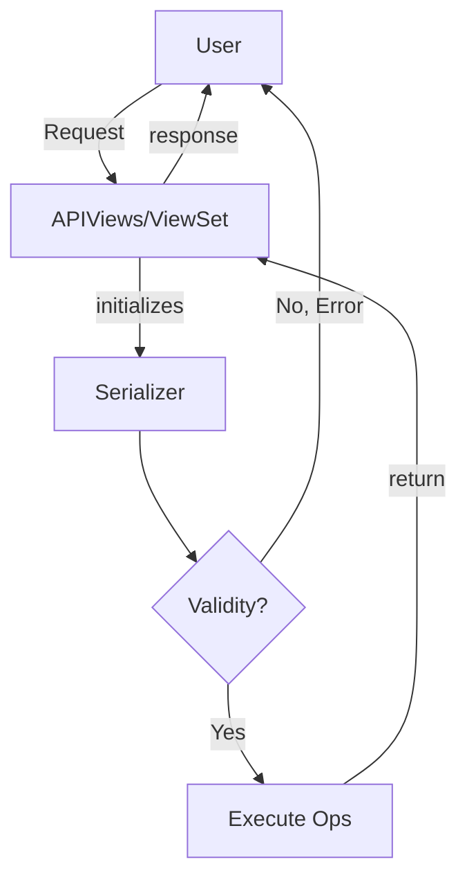

# DRF Serializers and Views

Serializers are nothing but converters that convert the received request data to python data types and does the processing of the stuff like creation, updating etc...

APIViews or ViewSets recieve the request pass it to the serializer which checks validity and execute some operations and then the APIViews returns a response.

---
## Related Notes

## References(links)
