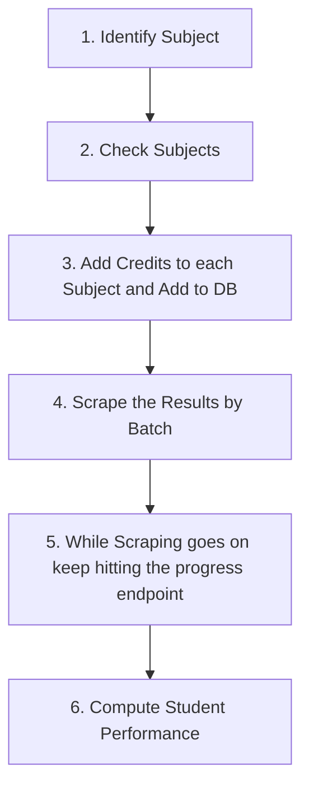

**PROJECT:** [[SyncWise]]

**LINK:** [Added necessary files for scraper integration into drf including initialilzing and using redis connections by Srikar-V675 · Pull Request #18 · Srikar-V675/syncwise · GitHub](https://github.com/Srikar-V675/syncwise/pull/18)

**BRANCH:** `scraping`

## Changes 
1. Added serializers for Identifying subjects, batch creating subjects from list, scraping students in a batch, computing performance of students after score is scraped
2. Added necessary views for the above serializers along with a view for getting the scraping info progress, total and errors from redis hash_name mapping
3. Changed the Score table to store the score in a JSONField and created helpers to compute total, percentage and sgpa from scores
4. Added code that initializes redis connection on startup and some helpers to make my life easier when communicating and updating the scraping info
5. Added some helper funcs to scraper.py and also created new file scraper_drf.py for utils related to drf and scraping.

## Description

### Scraping Steps



### 1. Identify Subjects

**endpoint:** `/api/identify/`

**request-type:** `POST`

**request-params:** 
```json
{
  "usn": "string",
  "result_url": "string"
}
```

**response-example:**
```json
{
  "subjects": [
    {
      "sub_name": "ENVIRONMENTAL STUDIES",
      "sub_code": "21CIV57"
    },
    {
      "sub_name": "AUTOMATA THEORY AND COMPILER DESIGN",
      "sub_code": "21CS51"
    },
    ...
  ],
  "status": "Succesfully scraped student results!!"
}
```

> [!note]-
> `status` in response will tell if any errors were there while scraping.

### 2. Check Subjects
- Check the returned subjects if there are any other subjects that needs to be added can be added when adding these subjects.

### 3. Add Credits to Each Subject and Add to DB
- Add the credits for each subject and send a request to the endpoint to add the subjects to the DB.

**endpoint:** `/api/subjects/`

**request-type:** `POST`

**request-params:** 
```json
{
  "sub_name": "string",
  "sub_code": "string",
  "credits": 9223372036854776000,
  "sem": 0
}
```

**request-example:**
```json
[
    {
      "sub_name": "ENVIRONMENTAL STUDIES",
      "sub_code": "21CIV57",
      "credits": 1,
      "sem": 1
    },
    {
      "sub_name": "AUTOMATA THEORY AND COMPILER DESIGN",
      "sub_code": "21CS51",
      "credits": 3,
      "sem": 1
    },
    ...
]
```

**response-example:**
```json
[
  {
    "id": 1,
    "sub_name": "ENVIRONMENTAL STUDIES",
    "sub_code": "21CIV57",
    "credits": 1,
    "sem": 1
  },
  {
    "id": 2,
    "sub_name": "AUTOMATA THEORY AND COMPILER DESIGN",
    "sub_code": "21CS51",
    "credits": 3,
    "sem": 1
  },
  ...
]
```

### 4. Scrape the results by Batch
- Now we can scrape the results one by one by Students present in that Batch with respect to the corresponding Semester.

**endpoint:** `/api/scrape/batch/`

**request-type:** `POST`

**request-params:**
```json
{
  "batch": 0,
  "semester": 0,
  "result_url": "string"
}
```

**request-example:**
```json
{
  "batch": 1,
  "semester": 1,
  "result_url": "https://results.vtu.ac.in/DJcbcs24/index.php"
}
```

**response-example:**
```json
{
  "message": "Scraping background task has started.",
  "redis_name": "e26dbfda-a0ba-43aa-b25c-1b5c24a0c1e4"
}
```

> [!warning]-
> This endpoint must be requested only when you are sure the Student objects are created for this Batch. You can make a request to `/api/upload/` for bulk upload of Student objects from a `.csv` file.

### 5. Keep Hitting the progress endpoint
- The scraping takes quite the time to execute hence it is created as a background task and is running another thread. In order to track the progress a redis_mapping is created that returns the scraping info that is needed. This endpoint helps us determine the end of the progress or any error in scraping.

**endpoint:** `/api/scrape/progress/{redis_name}/`

**request-type:** `GET`

**example-url-request:** `/api/scrape/progress/e26dbfda-a0ba-43aa-b25c-1b5c24a0c1e4/`

> [!note]-
> The code is the `redis_name` that is returned by scraping endpoint that is what we need to use to get the scraping info.

**response-example:**
```json
{
  "details": {
    "total": "6",
    "errors": "[]",
    "progress": "6"
  }
}
```

> [!warning]-
> If by any reason before the progress is 100% the endpoint returns an error then that means that the scraping has stopped due to an unforeseen problem or error.

### 6. Compute the Student Performance
- The above scraping only does the scraping and stores the scores in the DB but doesn't compute the performance of students like total, progress and sgpa.

**endpoint:** `/api/scrape/performance/`

**request-type:** `POST`

**request-params:**
```json
{
  "batch": 0,
  "semester": 0
}
```

**response-example:**
```json
{
  "message": "Succesfully computed student performances"
}
```

To implement both the **scraping workflow** and **dashboard functionality** in the frontend using HTML and CSS, you can follow these steps. The frontend will include forms for inputs required in the scraping steps and a dashboard to display data. Here's the refined plan:

---

### **Steps for Full Setup**

#### **Backend Preparation**

1. **Ensure All Endpoints are Functional**:
    
    - `/api/identify/` for subject scraping.
    - `/api/subjects/` for adding subjects to the database.
    - `/api/scrape/batch/` for batch scraping.
    - `/api/scrape/progress/{redis_name}/` for tracking scraping progress.
    - `/api/scrape/performance/` for computing student performance.
    - `ScoreViewSet` and `StudentPerformanceViewSet` for scores and performance data.
2. **Enable CORS**:
    
    - Install and configure Django CORS headers to allow your frontend to make API calls.
3. **JWT Authorization**:
    
    - Ensure your frontend can handle JWT authentication for API calls.

---

### **Frontend Steps**

#### **1. Structure the Frontend**

Create an HTML page with the following sections:

- **Header**: Title and navigation links.
- **Forms**: For each step of the scraping process:
    1. **Identify Subjects**:
        - Input: USN, result URL.
        - Button to trigger scraping.
        - Display scraped subjects.
    2. **Add Credits**:
        - Input: Subject details (pre-filled with scraped data for easy editing).
        - Input fields for `credits` and `semester`.
        - Button to add subjects.
    3. **Scrape Batch Results**:
        - Input: Batch, semester, result URL.
        - Button to start batch scraping.
    4. **Track Progress**:
        - Input: Redis name.
        - Button to check progress.
    5. **Compute Performance**:
        - Input: Batch, semester.
        - Button to compute performance.
- **Dashboard**: Placeholder for graphs and tables to display analytics.

#### **2. Create Forms for Each API Endpoint**

Use basic HTML forms with appropriate input fields and buttons to submit data to each endpoint.

---

#### **3. Implement Dashboard**

- **Graphs**:
    - Use Chart.js or static bar charts created with CSS.
    - Display performance metrics, subject averages, and batch trends.
- **Tables**:
    - Display scores and performance data using HTML tables styled with CSS.
    - Include sorting and filtering options for better usability.

---

#### **4. Handle API Calls**

Use JavaScript (plain or with a lightweight library like Axios) to:

- Fetch data from the backend endpoints.
- Populate forms with default/suggested values (e.g., scraped subjects for adding credits).
- Dynamically update graphs and tables on the dashboard.

---

#### **5. Styling**

- Use custom CSS or a framework like Bootstrap to ensure the layout is clean and responsive.

---

### **Implementation Order**

1. Build the forms for each scraping step, testing each API call individually.
2. Create the dashboard and integrate it with the backend to fetch scores and performance data.
3. Style the frontend for better usability.

---

Once you've decided the next step, let me know, and I'll provide the specific code to implement it!