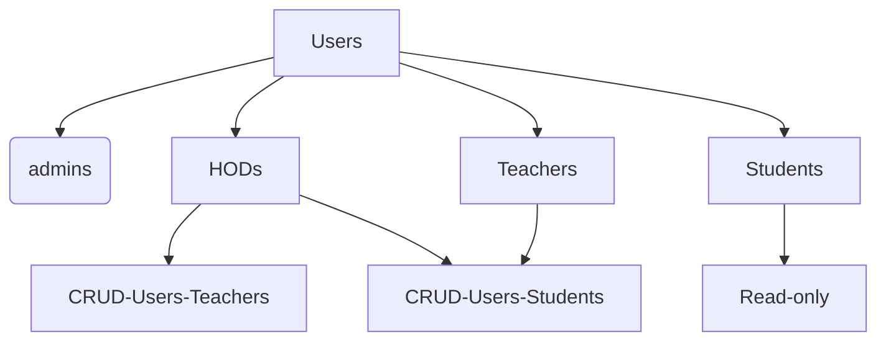

**PROJECT:** [[SyncWise]]
**LINK:** [GRADESYNC: started new app gradesync and added DB models. by Srikar-V675 · Pull Request #6 · Srikar-V675/syncwise · GitHub](https://github.com/Srikar-V675/syncwise/pull/6)
**BRANCH:** fastapi-to-drf

## Changes 
- Created the db models that is needed for [[GradeSync]]. 
- Extended the default users table to have department foreign key.
- Created groups: `HODs, Teachers, Students` and gave appropriate permissions
- Customised the admin page to reflect the permissions set above for CRUD operations by different groups.

## Description

#### DB models
Refer here for the updated db-design: [[gradesync db-design updated]]

#### Department FK in users
In the above Schema you can see that the departments is extended as a foriegn key to the users table. I've decided to go with this because I'm pretty sure our users would either be teachers or students. They belong to one department and they must be able to access the data related to their department only. 

#### Groups and Permissions
Since our users are either teachers or students, we need to make sure they have the right permissions to perform the actions they are allowed to do. For example: teachers can perform CRUD ops on students while the students can only read. 

I looked into two options:
1. one was to create another table called `Roles`.
2. second was to use the groups and permissions feature given by django as default. 

Creating another table `Roles` would create an extra overhead for us to keep checking the roles for every endpoint or feature we try to implement. 

In the case of groups and permissions, we would need effort in setting up in the first. But after that we can just use the default permissions or custom permissions when we want to make sure the right group accesses it. 

**HODs:** this group is for performing CRUD ops on both `Teachers` and `Students`. As there needs to be someone to manage `Teachers` too. 

**Teachers:** this group is performing CRUD ops on `Students` alone. You can guess why. 

**Students:** they essentially don't have any permissions except read. 

#### Custom Admin Page

I've created custom admin pages for the groups: `HODs` and `Teachers`, as these groups are the ones that perform CRUD ops on the users. 

I've created an admin model form from the users model to manipulate the form options based on the group the user belongs to. 

`HODs` have the power to create, update, read and delete both teachers and students. HODs are responsible for managing the teachers. 

`Teachers` have the power to create, update, read and delete students. They are responsible for managing the students. 

> NOTE: both groups can only perform ops on the users that belong to their department.

> Refer to the setup.md file to make the migrations and create the default groups.

## Next tasks 
- [ ] create unit test for testing the above changes
- [ ] allow bulk student user creation(from excel files)
- [ ] admin page for teachers must have filtering options based on student profile
- [ ] for HODs and superusers the Users must be segregrated by groups with distinction.