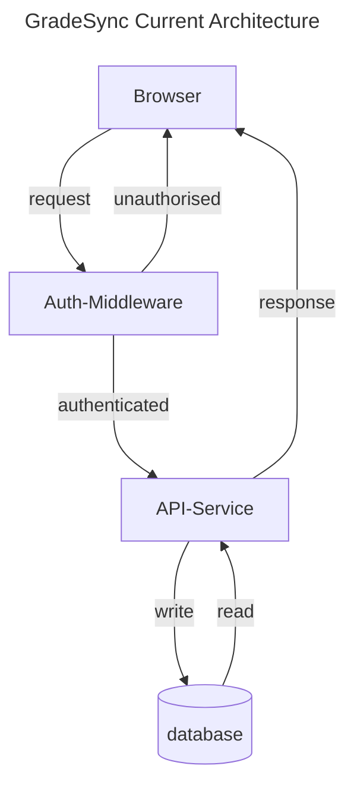

# gradesync architecture

**PROJECT:** [[SyncWise]]

## Architecture

```mermaid
---
title: GradeSync Current Architecture
---
flowchart TD
	Browser -- request ---> Auth-Middleware
	Auth-Middleware -- authenticated ---> API-Service
	Auth-Middleware -- unauthorised ---> Browser
	API-Service -- write ---> db[(database)]
	db[(database)] -- read --> API-Service
	API-Service -- response ---> Browser
```
