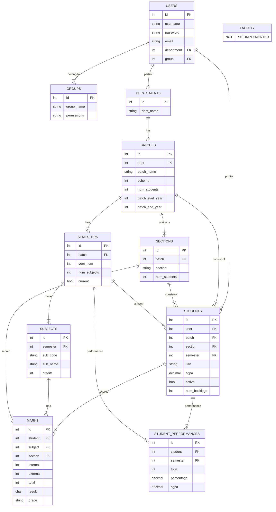

# # gradesync db-design updates

**PROJECT:** [[SyncWise]]

## Schema

```mermaid
erDiagram
	GROUPS {
		int id PK
		string group_name
		string permissions
	}
	USERS {
		int id PK
		string username
		string password
		string email
		int department FK
		int group FK
	}
    DEPARTMENTS {
        int id PK
        string dept_name
    }
    BATCHES {
        int id PK
        int dept FK
        string batch_name 
        int scheme
        int num_students 
        int batch_start_year
        int batch_end_year
    }
    SECTIONS {
	    int id PK
        int batch FK
        string section 
        int num_students
    }
    SEMESTERS {
	    int id PK
	    int batch FK
	    int sem_num 
	    int num_subjects 
	    bool current
    }
    STUDENTS {
     int id PK
     int user FK
     int batch FK
     int section FK
     int semester FK
     string usn
     decimal cgpa
     bool active
     int num_backlogs
    }
    SUBJECTS {
	    int id PK
	    int semester FK
	    string sub_code
	    string sub_name
	    int credits
    }
    FACULTY {
	    NOT YET-IMPLEMENTED
    }
    MARKS {
	    int id PK
	    int student FK
	    int subject FK
	    int section FK
	    int internal
	    int external
	    int total
	    char result 
	    string grade 
    }
    STUDENT_PERFORMANCES {
	    int id PK
	    int student FK
	    int semester FK
	    int total 
	    decimal percentage 
	    decimal sgpa
    }
    USERS ||--|{ DEPARTMENTS : part-of
    USERS ||--|{ STUDENTS : profile
    USERS ||--|{ GROUPS : belong-to
	BATCHES ||--|{ SECTIONS : contains 
	BATCHES ||--|{ SEMESTERS : has 
	BATCHES ||--|{ STUDENTS : consist-of
	SECTIONS ||--|{ STUDENTS : consist-of
	DEPARTMENTS ||--|{ BATCHES : has
	SEMESTERS ||--|{ STUDENTS : current
	SEMESTERS ||--|{ SUBJECTS : have
	STUDENTS ||--|{ MARKS : scored
	SUBJECTS ||--|{ MARKS : has 
	SECTIONS ||--|{ MARKS : scored
	STUDENTS ||--|{ STUDENT_PERFORMANCES : performance 
	SEMESTERS ||--|{ STUDENT_PERFORMANCES : performance
```
