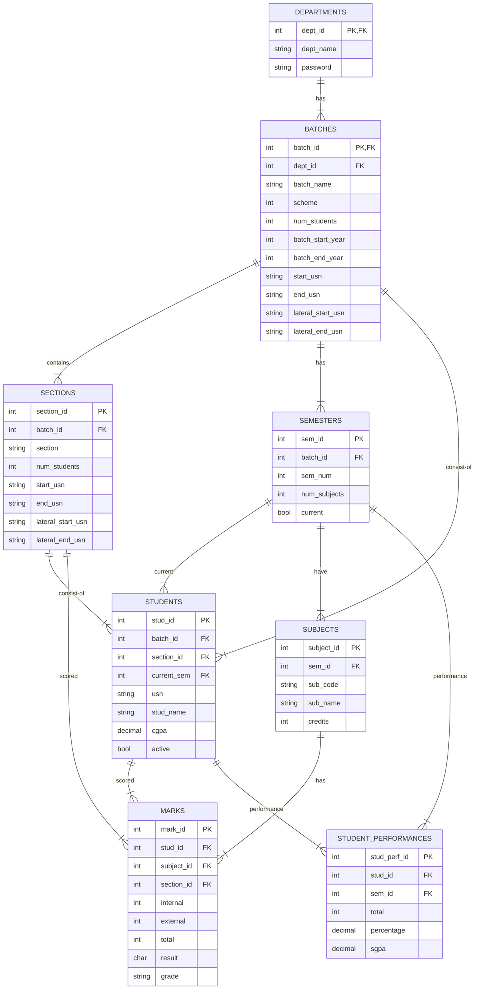

# gradesync db-design

**PROJECT:** [[SyncWise]]

### DB Design 

```mermaid
erDiagram
    DEPARTMENTS {
        int dept_id PK, FK
        string dept_name
        string password
    }
    BATCHES {
        int batch_id PK, FK
        int dept_id FK
        string batch_name 
        int scheme
        int num_students 
        int batch_start_year
        int batch_end_year 
        string start_usn 
        string end_usn 
        string lateral_start_usn 
        string lateral_end_usn 
    }
    SECTIONS {
	    int section_id PK
        int batch_id FK
        string section 
        int num_students 
        string start_usn 
        string end_usn 
        string lateral_start_usn 
        string lateral_end_usn 
    }
    SEMESTERS {
	    int sem_id PK
	    int batch_id FK
	    int sem_num 
	    int num_subjects 
	    bool current
    }
    STUDENTS {
     int stud_id PK
     int batch_id FK
     int section_id FK
     int current_sem FK
     string usn 
     string stud_name 
     decimal cgpa
     bool active
    }
    SUBJECTS {
	    int subject_id PK
	    int sem_id FK
	    string sub_code 
	    string sub_name
	    int credits
    }
    MARKS {
	    int mark_id PK
	    int stud_id FK
	    int subject_id FK
	    int section_id FK
	    int internal
	    int external
	    int total
	    char result 
	    string grade 
    }
    STUDENT_PERFORMANCES {
	    int stud_perf_id PK
	    int stud_id FK
	    int sem_id FK
	    int total 
	    decimal percentage 
	    decimal sgpa
    }
	BATCHES ||--|{ SECTIONS : contains 
	BATCHES ||--|{ SEMESTERS : has 
	BATCHES ||--|{ STUDENTS : consist-of
	SECTIONS ||--|{ STUDENTS : consist-of
	DEPARTMENTS ||--|{ BATCHES : has
	SEMESTERS ||--|{ STUDENTS : current
	SEMESTERS ||--|{ SUBJECTS : have
	STUDENTS ||--|{ MARKS : scored
	SUBJECTS ||--|{ MARKS : has 
	SECTIONS ||--|{ MARKS : scored
	STUDENTS ||--|{ STUDENT_PERFORMANCES : performance 
	SEMESTERS ||--|{ STUDENT_PERFORMANCES : performance
```
