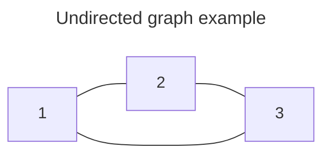

# graph representations

# Graph Representations

## Summary
[[graphs]] are unstructured data structures and have more freedom than [[trees]] hence there are several ways to represent [[graphs]] and each one of them have their pros and cons. 



### Edge List 
Represents [[graphs]] as a list(or array) of mapping between vertices which is also an individual [[Arrays]] of vertices pairs. 

```
edge-list = [
	[1, 2],
	[2, 3],
	[3, 1]
]
```

> [!tip]-
> **The pairs are unordered for undirected graphs and ordered for directed graphs.** 

### Adjacency [[Matrix]] 
Represents [[graphs]] as a 2D [[Matrix]] with either 0, 1 or a number. The rows and columns represents the vertices and the corresponding value at \[row, col] gives us the edge.

| Value at \[i, j] | 0                                   | 1                                | num                                        |
| ---------------- | ----------------------------------- | -------------------------------- | ------------------------------------------ |
| **Meaning**      | *no edge between node i and node j* | *edge between node i and node j* | *weight of edge between node i and node j* |

```
  1  2  3
  --------
1|0  1  1
2|1  0  1
3|1  1  0
```

> [!important]-
> Undirected graphs adjacency matrix are symmetric along the diagonal and directed graphs adjacency matrix are un-symmetric along the diagonal. 

### Adjacency List 
Represents [[graphs]] as a list of vertices where each vertex points to a [[Linked List]] that contains pointers to the vertices that have edges from this vertex. 

```
[
	1 --> 2 --> 3 --> NULL
	2 --> 3 --> 1 --> NULL
	3 --> 1 --> 2 --> NULL
]
```

### Hash table of [[hash tables]]
Represents graphs as literally what the name means where the outer hash table contains the vertices and each vertex has its own [[hash tables]] that contains the vertices it has a edge to.

```
{
	1: {2, 3},
	2: {1, 3},
	3: {1, 2}
}
```

### 2D Grid or [[Matrix]]
This is a special type of representation for [[graphs]], it is similar to adjacency matrix but is functionally different in the way it represents the [[graphs]]. 

This representation is commonly used to represent spatial problems like mazes, finding islands etc.

**Points to remember:**
1. Each cell is a node, unlike how in adjacency matrix each cell is an edge. 
2. And each nodes are neighbours are literally the nodes that are adjacent to it in the matrix. 
3. In many cases 0 represents a boundary that means that if the neighbour of a node is 0 then that means that the current node can't visit that node. 

```
1 1 1 0
0 1 1 0
0 0 0 0
0 1 1 0
```

> [!example]-
> Let's take an example of islands. To represent this we can use 1s for an island and 0s for sea or water. It's clear that you can't go from sea to island and island to sea. And each cell in this grid represents either sea or island. You can also take an example of a maze where each node is either a path or a wall. 

![[graphs-2d-grid.excalidraw.png]]

### Complexity

| Representation                | Time Complexity | Space Complexity              | Problems                                                                                                                                                                                                        |
| ----------------------------- | --------------- | ----------------------------- | --------------------------------------------------------------------------------------------------------------------------------------------------------------------------------------------------------------- |
| Edge List                     | $$O(E)$$        | $$O(E)$$                      | Access or search for an edge takes linear time and defeats the purpose even though we have O(E) extra space.                                                                                                    |
| Adjacency [[Matrix]]          | $$O(1)$$        | $$O(V^2)$$                    | Access, insert, delete and search of an edge is constant time which is good but we always need an extra space of O(V^2) regardless of the number of edges. Hence if we have a sparse graph then space is waste. |
| Adjacency List                | $$O(d)$$        | $$O(E)$$<br>(OR)<br>$$O(2E)$$ | Refer to: [[adjacency list problems]]                                                                                                                                                                           |
| Hash table of [[hash tables]] | $$O(1)$$        | $$O(E)$$<br>(OR)<br>$$O(2E)$$ | It is a pretty solid representation for graphs.                                                                                                                                                                 |
| 2D Grid                       | $$O(1)$$        | $$O(Row \ . \ Col)$$          | This kind of representation is good for spatial problems where the edges are adjacent to nodes(up, down, left, right, maybe diagonal too). And they can be space in-efficient for sparse graphs.                |

---
## Related Notes
[[graphs]]
[[adjacency list problems]]

## References(links)
[From Theory To Practice: Representing Graphs | by Vaidehi Joshi | basecs | Medium](https://medium.com/basecs/from-theory-to-practice-representing-graphs-cfd782c5be38)

---
## Related Notes

## References(links)
