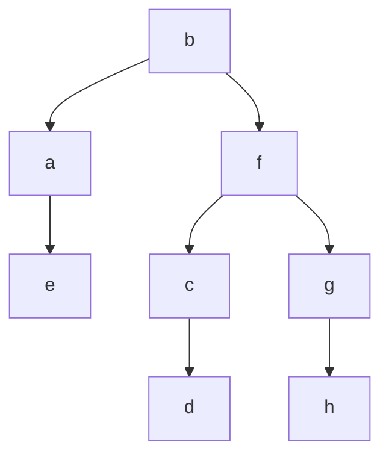

# Breadth First Search
## Summary
Similar to how we implement [[tree level order traversal]] which is nothing but breadth first search, where we visit each node in a level and only then move on to the next level. 

The basic steps of breadth first search in graphs are: 
1. Add the first node to the [[Queue]] and mark it as visited. 
2. Determine the neighbours of the topmost node in the [[Queue]].
3. Visit the neighbours if not in *visited* and add them to the [[Queue]] and mark them as visited. 
4. Pop the topmost node in the [[Queue]].

We are visiting the nodes and adding them to the [[Queue]] and marking them visited. 
Q: Why are you adding to the [[Queue]] if you have visited it already? 
A: because I want to make sure I visit the neighbours of the node that I just visited. 

![[graph-bfs-example.excalidraw.png]]

> [!note]-
> **If a node is visited then the traversal doesn't visit it again it instead ignores it.**

If we map the path the traversal took as a tree ignoring the lookups of visited edges. Then we get this:


> [!important]+
> **The power of using BFS to traverse through a [[graphs]] is that it can easily and will always tell us the shortest way of getting from one node to another. You can validate it in the above [[trees]] that the traversal mapped.**

> [!tip]-
> **We will need an extra data structure to check the vertex is visited or not.**

### Time Complexity

$$
O(V + E)
$$

$$O(Row \ . \ Col)$$

**Why?** 
A: If we think of how we traverse for a single node. What we do is for each node we visit, we lookup its neighbouring nodes regardless of the fact that it was visited or is in the queue. Hence we we would be looking up each edge and also visiting each vertex hence the time complexity is the sum of them. 

> [!hint]+
> O(V + E) is valid for any [[graph representations]] that have the exact edges. But in the case of [[graph representations#2D Grid or Matrix]] for which the complexity is O(Row . Col) in the worst case.


> [!important]+
> For an undirected graph, we would be visiting all vertices `V` and `2E` edges. For a directed [[graphs]], we would be visiting all vertices `V` and `E` edges. 

## Code

### [[Matrix]]
```python
num_rows, num_cols = len(matrx), len(matrix[0])
def get_neighbours(coord):
	row, col = coord
	directions = [(0, 1), (0, -1), (1, 0), (-1, 0)]
	neighbours = []
	for direction in directions:
		next_row = row + direction[0]
		next_col = col + direction[1]
		if 0 <= next_row < num_rows and 0 <= next_col < num_cols:
			neighbours.append((next_row, next_col))
	return neighbours

def bfs(starting_node):
	q = deque([starting_node])
	visited = set([starting_node])
	while q:
		node = q.popleft()
		for neighbour in get_neighbours(node):
			if neighbour in visited:
				continue 
			# Do stuff with the node if required
			# ...
			q.append(neighbour)
			visited.add(neighbour)
```

### Other Representations
The `bfs` function remains the same. *get_neighbours()* is the function that changes cause that is where we determine the neighbours.

---
## Related Notes
[[graphs]] 
[[graph representations]] 
[[tree level order traversal]] 

## References(links)
[Going Broad In A Graph: BFS Traversal | by Vaidehi Joshi | basecs | Medium](https://medium.com/basecs/going-broad-in-a-graph-bfs-traversal-959bd1a09255)