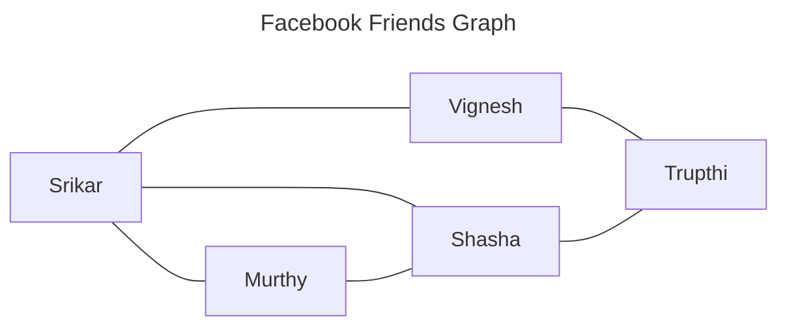
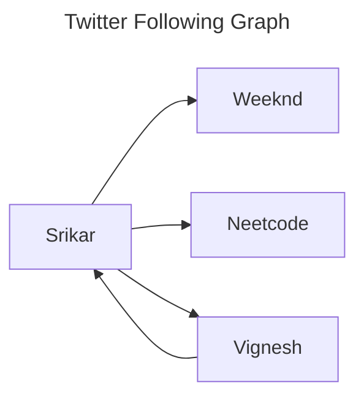

# Graphs 

## Summary
Graphs is an abstract data structure derived from mathematics, it is a set of objects (nodes or vertices) where there can be edges that connect these nodes or vertices. 

Mathematical definition of a graph:
$$
G = (V, \ E)
$$

Edges can be directed, undirected and can also have weights. [[trees]] are undirected and acyclic graphs. [[trees]] can be considered as a subset of graphs. 

> [!quote]+
> "A tree will always be a graph, but not all graphs will be trees."

> [!info]-
> [[trees]] have a set of rules that need to be followed to make them a tree, while [[graphs]] don't have any of these rules, the one and only rule is there are nodes and there are edges that connect these nodes. [[graphs]] are like the pirates and [[trees]] are like the marines from the one piece world.

Graphs are used to represent relationships between objects (nodes or vertices) like social media following, distance between locations etc

## Tasks
- [x] Topological sorting ✅ 2024-10-13
- [ ] Dijkstra's 
- [ ] Types of graphs 
- [x] DFS, BFS, Topological sorting, dijikstra's code. ✅ 2024-10-13

---
## Related Notes
[[graph representations]]
[[graphs breadth first search]]
[[trees]]
[[graphs depth first search]]
[[directed acyclic graphs]]
[[topological sorting]]
[[topological sorting using dfs]]
[[topological sorting using khan's algo]]
[[types of graph edges]]

## References(links)
[A Gentle Introduction To Graph Theory | by Vaidehi Joshi | basecs | Medium](https://medium.com/basecs/a-gentle-introduction-to-graph-theory-77969829ead8)