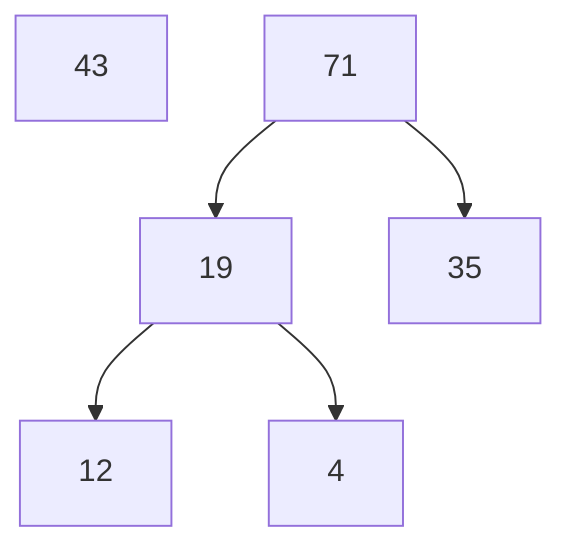
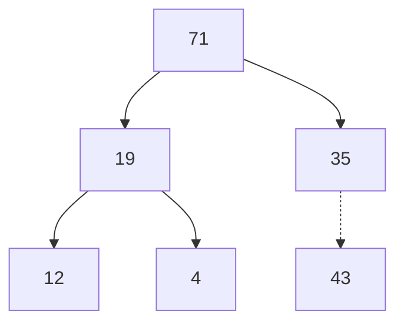
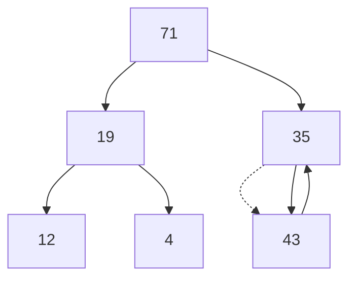
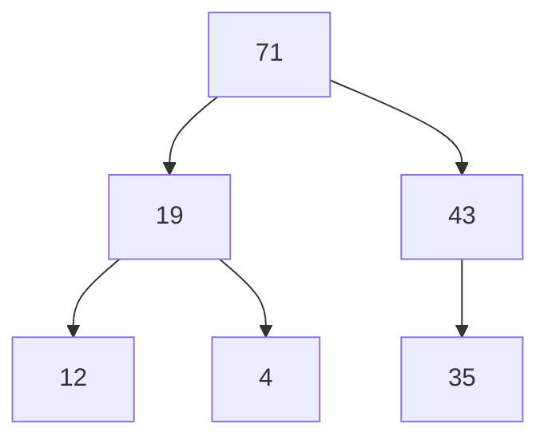

# Growing a Heap

Remember the two properties of [[heaps]]:
1. **Complete Binary Tree** with last level having elements filled from the left side.
2. **Heap-Order property**.

### Steps
*Example:* `max-heap`
1. To maintain the *Complete Binary Tree* property we can only add a node in the left side of the last level. 
2. Since we added at the last level we assumed that the new element is lesser than its parents(max-heap).
3. The above assumption may not be true hence to maintain the *Heap Order property* we need to check and swap with its parents -> **Heapify UP**.

---
## Related Notes
[[manipulating heaps]]
[[heaps]]
[[shrinking a heap]]

## References(links)
[Learning to Love Heaps. Today marks the halfway point of this… | by Vaidehi Joshi | basecs | Medium](https://medium.com/basecs/learning-to-love-heaps-cef2b273a238)