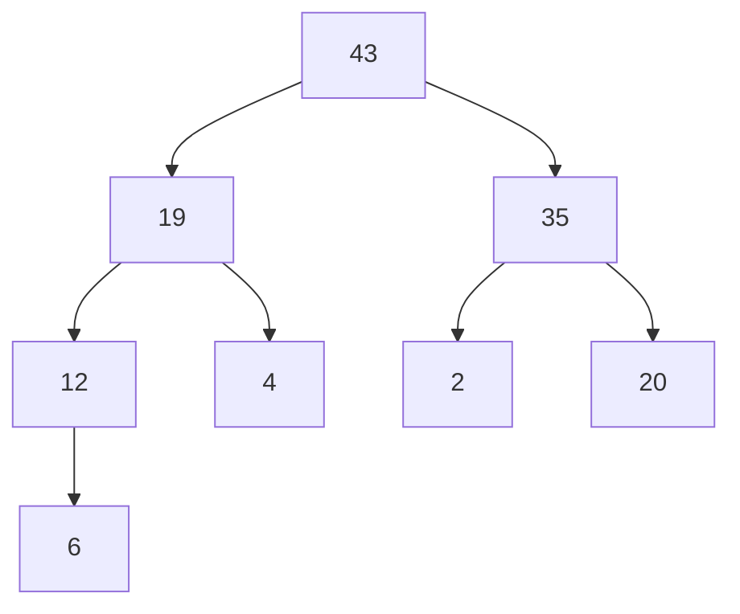

# Heap as Priority Queue

[[heaps implementation|heaps]] are implemented as [[arrays]], but why? So that they can be used as [[priority queue]].

From [[heaps implementation]] we know that they are implemented as a [[arrays]] because it allows for easy access of parent and children nodes. Consider a `max-heap`.

![[heap-priority-queue.excalidraw.png]]

**Find highest priority,**
$$O(1)$$

**Insert/Delete([[growing a heap]]/[[shrinking a heap]]**,
$$O(log\ n)$$
because of the binary tree structure of [[heaps]].

Every time we dequeue or enqueue we need to [[growing a heap]] and [[shrinking a heap]].

**Why [[heaps]] and not [[binary trees and binary search trees|binary search trees]] for [[priority queue]]?**
A: [[why not bst as priority queue]]

---
## Related Notes
[[heaps implementation]]
[[heaps]]
[[queue]]
[[arrays]]

## References(links)
[For shrinking a heap, why do we need to remove the root node first and then...](https://www.perplexity.ai/search/for-shrinking-a-heap-why-do-we-LeuK2tAWTveZfE0D6EJfzg)

[Heapify All The Things With Heap Sort | by Vaidehi Joshi | basecs | Medium](https://medium.com/basecs/heapify-all-the-things-with-heap-sort-55ee1c93af82)