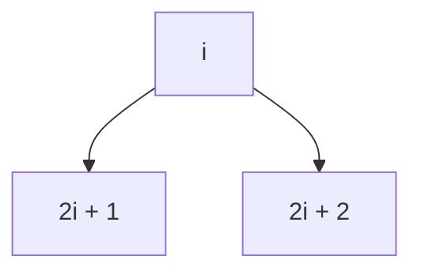

# Heaps Implementation

[[heaps]] can be easily implemented using [[linked list]] just like we do it for [[trees]], but there is another way that is prioritised i.e [[arrays]].

We can notice that [[heaps]] are partially sorted structures, they are not fully sorted like [[binary trees and binary search trees|binary search trees]] but are partially sorted. Since they are partially sorted and [[heaps]] are supposed to **complete binary trees** we can access the elements using maths.

**where,**
`i` -> index 

**Left child:**
$$2i + 1$$

**Right child:**
$$2i + 2$$

**Index of Parent Node:**
$$\lfloor \frac{i - 1}{2} \rfloor$$

**where below symbol is floor,**
$$\lfloor ...\rfloor$$

**Why [[heaps]] is implemented as [[arrays]]?**
A: [[heap as priority queue]]

---
## Related Notes
[[heaps]]
[[arrays]]
[[linked list]]

## References(links)
[Learning to Love Heaps. Today marks the halfway point of this… | by Vaidehi Joshi | basecs | Medium](https://medium.com/basecs/learning-to-love-heaps-cef2b273a238)