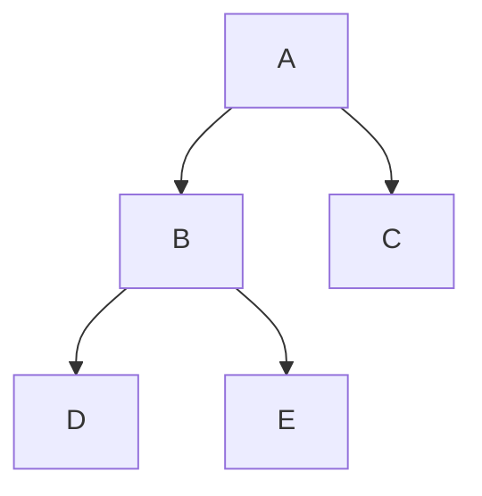

# Heaps

Heaps is an example of a data structure that makes use of multiple concepts that we have learnt so far. 

Heaps is essentially a [[binary trees and binary search trees|binary tree]] that is supposed to follow an extra number of rules that make it a heap.

**Properties:**
1. *Shape of tree:* 
	- must be a complete binary tree. 
	- last level should always have its leftmost nodes present.

2. *Order of nodes*

### Order of Nodes 

- [[max heaps]]
- [[min heaps]]

also called the `heap-order property` 

[[manipulating heaps]]
[[heaps implementation]]
[[content/🥷🏽 jutsus/latex]]
---
## Related Notes
[[binary trees and binary search trees]]
[[trees]]

## References(links)
[Learning to Love Heaps. Today marks the halfway point of this… | by Vaidehi Joshi | basecs | Medium](https://medium.com/basecs/learning-to-love-heaps-cef2b273a238)