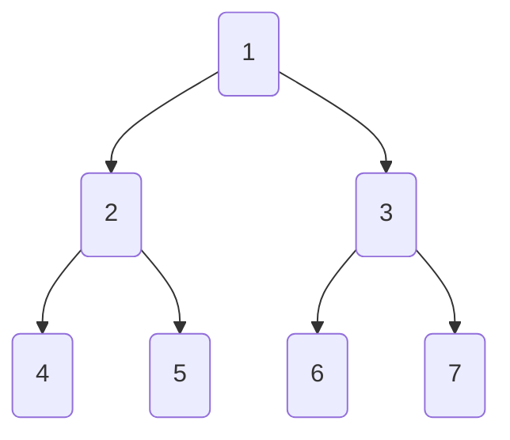

# level order traversal by level dry run



![[tree level order traversal#Iterative Code by Level]]

*Iteration-0:*
```
q = [1]
level = []
res = []
```

*Iteration-1:*
```
q = [2, 3]
level = [1]
res = [ [1], ]
```

*Iteration-2:*
```
q = [4, 5, 6, 7]
level = [2, 3]
res = [ 
	[1], 
	[2, 3]
]
```

*Iteration-3:*
```
q = []
level = [4, 5, 6, 7]
res = [ 
	[1], 
	[2, 3], 
	[4, 5, 6, 7]
]
```

---

### Related Notes
[[tree level order traversal]]
[[trees]]

### References(links)
Neetcode.io yt videos. check it out.