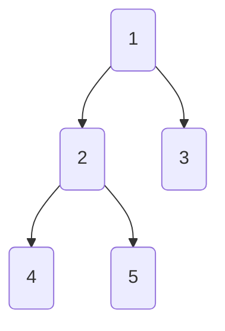

# Level Order Traversal Dry Run



![[tree level order traversal#Iterative Code]]

*Iteration-0:*
```
q = [1]
res = None
```

*Iteration-1:*
```
q = [2, 3]
res = 1
```

*Iteration-2:*
```
q = [3, 4, 5]
res = 1, 2
```

*Iteration-3:*
```
q = [4, 5]
res = 1, 2, 3
```

*Iteration-4:*
```
q = [5]
res = 1, 2, 3, 4
```

*Iteration-5:*
```
q = []
res = 1, 2, 3, 4, 5

ends because q is empty
```

---
### Related Notes
[[tree level order traversal]]
[[trees]]

### References(links)
Neetcode.io yt videos. check it out.