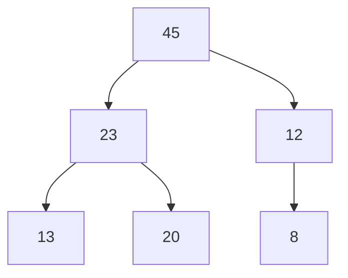

# Max Heaps

Max heaps are [[heaps]] where every single parent node is greater than or equal to its children. The maximum value is always at the root node. 

> [!note]
> There is no explicit rule that states it to follow the [[binary trees and binary search trees|binary search trees]] rules. [[heaps]] don't have to follow the strict ordering of BSTs. Heaps allow for duplicates.

---
## Related Notes
[[heaps]]
[[binary trees and binary search trees]]
[[trees]]
[[min heaps]]

## References(links)
[Learning to Love Heaps. Today marks the halfway point of this… | by Vaidehi Joshi | basecs | Medium](https://medium.com/basecs/learning-to-love-heaps-cef2b273a238)