# Mermaid Diagrams

## Summary
Mermaid is a tool that let's you create diagrams and visualisations using text and code. It is pretty easy if we are used to markdown and I feel is a very helpful tool in my obsidian note-taking workflow.

## Graph / Flowchart
### Example
```
graph TD;
	A --> B
	A --> C
	C --> C
```
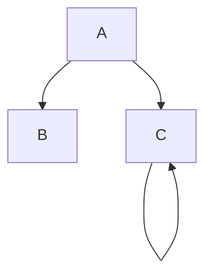

### Node Shape 
**round edges:**
```
flowchart LR
    id1(This is the text in the box)
```
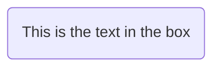
**ovalish:**
```
flowchart LR
    id1([This is the text in the box])
```
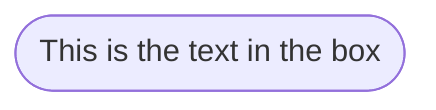
**database:**
```
flowchart LR
    id1[(Database)]
```
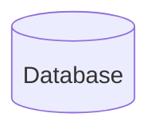
**circle:**
```
flowchart LR
    id1((This is the text in the circle))
```
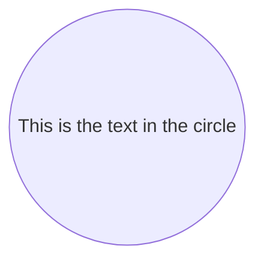

### Links b/w Nodes
**arrow link:**
```
flowchart LR
    A-->B
```

**no arrow link:**
```flowchart LR
    A---B
```
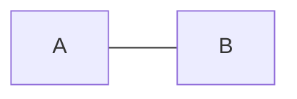
**text on link:**
```
flowchart LR
    A-- text -->B
```
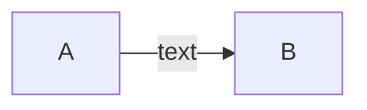
**dotted link:**
```
flowchart LR
   A-.->B;
```

**dotted link with text:**
```
flowchart LR
   A-. text .-> B
```
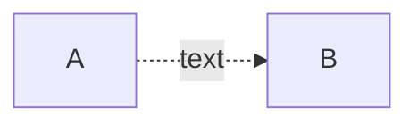
**thick link:**
```
flowchart LR
   A ==> B
```
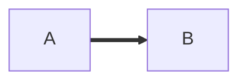

### Arrow Types
**circle edge:**
```
flowchart LR
    A --o B
```
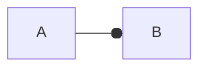
**cross-edge:**
```
flowchart LR
    A --x B
```
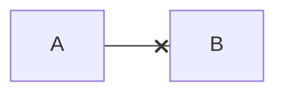
### Subgraphs
```
flowchart TB
    c1-->a2
    subgraph one
    a1-->a2
    end
    subgraph two
    b1-->b2
    end
    subgraph three
    c1-->c2
    end
    one --> two
    three --> two
    two --> c2
```
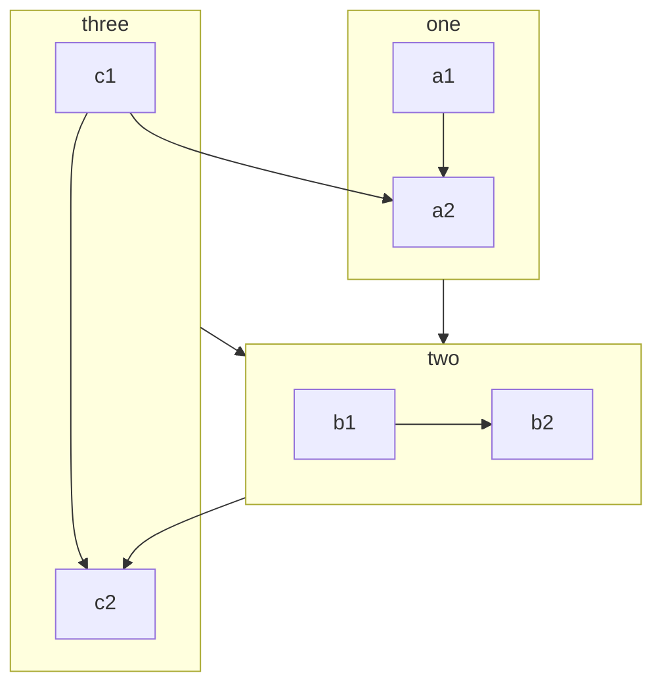


## ER-Diagrams
### Example 
```
---
title: Order example
---
erDiagram
    CUSTOMER ||--o{ ORDER : places
    ORDER ||--|{ LINE-ITEM : contains
    CUSTOMER }|..|{ DELIVERY-ADDRESS : uses
```
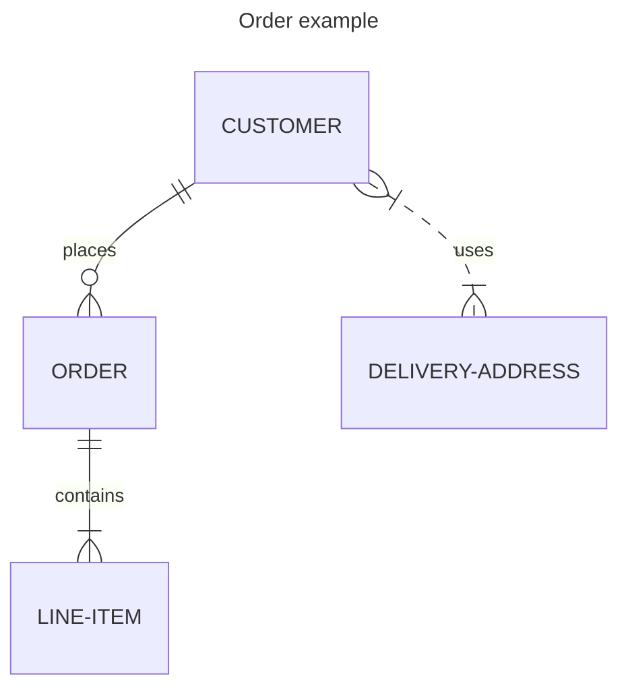
```
erDiagram
    CUSTOMER ||--o{ ORDER : places
    CUSTOMER {
        string name
        string custNumber
        string sector
    }
    ORDER ||--|{ LINE-ITEM : contains
    ORDER {
        int orderNumber
        string deliveryAddress
    }
    LINE-ITEM {
        string productCode
        int quantity
        float pricePerUnit
    }
```
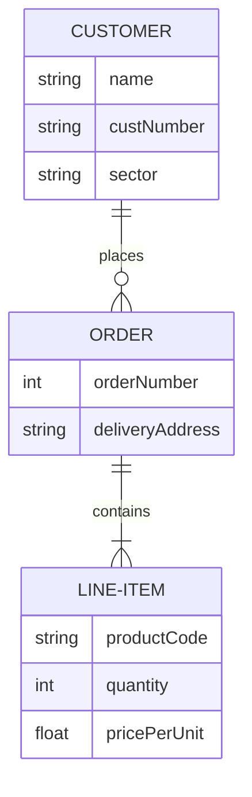


## Mindmap
### Example 
```
  root((mindmap))
    Origins
      Long history
      Popularisation
        British popular psychology author Tony Buzan
    Research
      On effectiveness<br/>and features
      On Automatic creation
        Uses
            Creative techniques
            Strategic planning
            Argument mapping
    Tools
      Pen and paper
      Mermaid
```
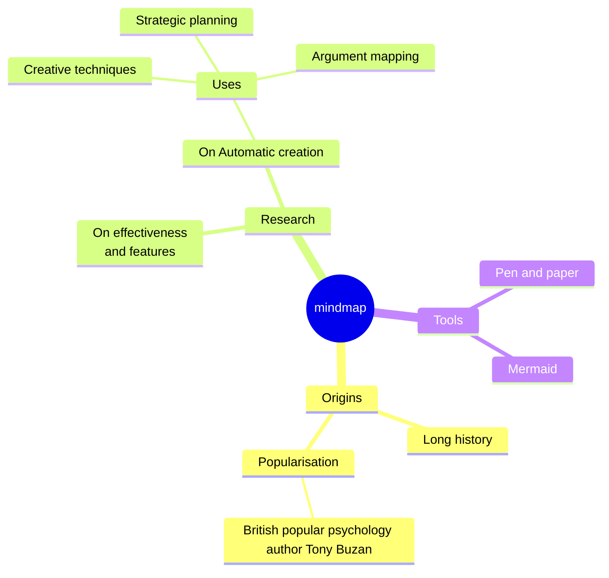
### shapes 
refer: [[mermaid diagrams docs#Node Shape]]
**bang:**
```
mindmap
    root))I am a bang((
		A
```
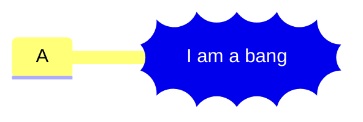
**cloud:**
```
mindmap
    root)I am a cloud(
		A
```
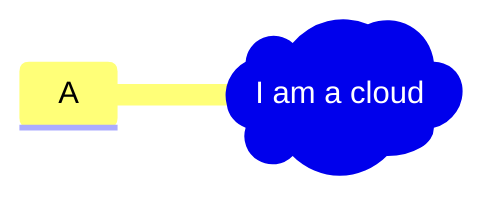

## Tasks
- [ ] Further explore ER diagrams. refer: [Entity Relationship Diagrams | Mermaid](https://mermaid.js.org/syntax/entityRelationshipDiagram.html)
- [ ] Architecture diagrams. refer: [Architecture Diagrams Documentation (v11.1.0+) | Mermaid](https://mermaid.js.org/syntax/architecture.html)
- [ ] state diagrams. refer: [State diagrams | Mermaid](https://mermaid.js.org/syntax/stateDiagram.html)

---
## Related Notes

## References(links)
[About Mermaid | Mermaid](https://mermaid.js.org/intro/)
