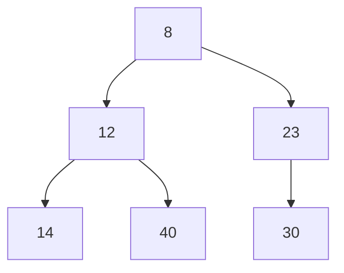

# Min Heaps

same as [[max heaps]] but the opposite.

---
## Related Notes
[[max heaps]]
[[heaps]]
[[trees]]
[[binary trees and binary search trees]]

## References(links)
[Learning to Love Heaps. Today marks the halfway point of this… | by Vaidehi Joshi | basecs | Medium](https://medium.com/basecs/learning-to-love-heaps-cef2b273a238)