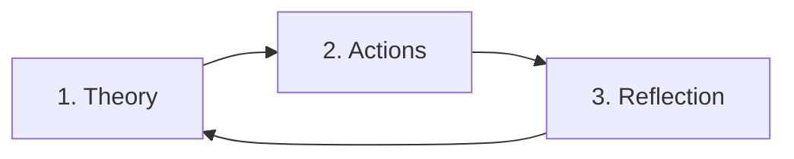

**SOURCE:** 

**LINKS:**

> [!tldr]
> Important points from the 2hr vid I watched by `outperform` on yt. It contains many insights on how to manage motivation, procrastination, learning, planning.

## Level up main skill while maintaining others

**MV:** Maintenance Volume -> volume to maintain your current state
**MEV:** Min. Effective Volume -> volume to get better
**MRV:** Max. Recovery Volume -> volume from which you can recover from

- body MRV < sum(each body MRV)
- you can't go 100% for all body parts/areas of life cause it only decreases your MRV of body

> [!note]+
> Don't remain in the inefficiency zones between MV and MEV, remove any inefficiency which will in turn increase your life tank.

## Manage multiple skills

- Split your work by sessions for these skills
- Think in sessions per week and not doing all of them everyday

## Art of Goal-Setting

**Goals -> Problems -> Diagnosis -> Design -> Doing**

- do not neglect the problems you are facing
- identify root case while diagnosing -> your character and not symptoms

```
Keep a yearly goal and then plan for it quaterly. Doing so gives you:
1. Urgency effect 
2. Motivation effect 
3. Faster feedback loops
```

## Framework for continuous learning 



- Concentrate more on actions and reflections. [actions -> something unique to your thinking]
- At earlier stages of learning be more vulnerable and expose yourself to situations that let you learn things rather then being right and winning.
- Look for internal rewards for learning something that helps you on the long term and don't seek external validation or rewards(winning)
- fail fast but don't fail forever
- compare fear of failure with failure of not leveling up

## Power of pushing just a bit more

- Effects compound rather than being neutral. $1^{365} > 1.1^{365}$
- Pushing just a tiny bit more everyday makes a whole lot of difference

## Why you give up early?

- results will always come suddenly and exponentially after a long time until it comes you need to keep hustling

## Get more things done 

1. remove all fucking distractions
2. batching -> group all similar tasks and finish them in one go

## End procrastination

- The tasks you avoid are the exact task that needs to be done `now`
- when you procrastinate you write to get your thoughts right 
- journal your thoughts -> try doing the task -> reflect on it

## Outsmart overwhelm

- main idea is to get into a flow state 
- to get into flow state first remove all distractions and then make sure you know what tasks you need to work on
- if you are feeling bad then decrease the load(but never zero) 
- just start the task if you are feeling better then increase the workload. the point is to match your energy with the workload and not just letting it go to zero

> [!tip]
> Make sure to practice gratitude on a daily basis keeps you from falling into the trap of constant self-improvement. Appreciate yourself, your surroundings, your people etc.

