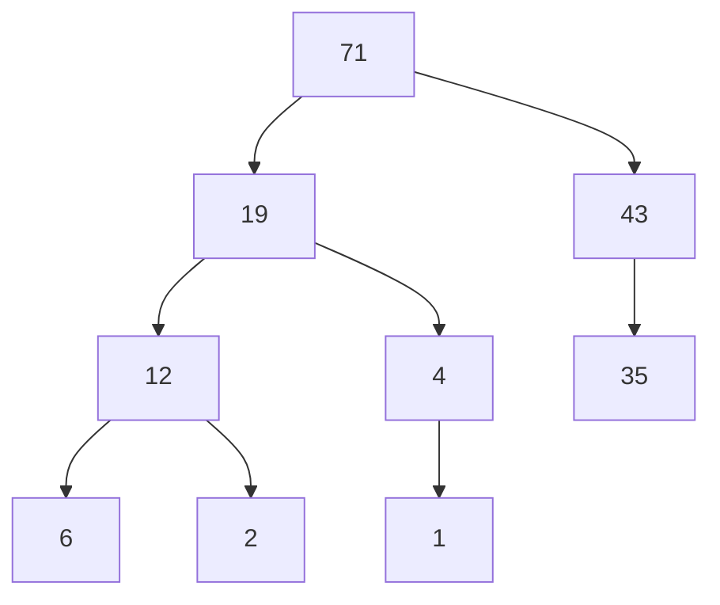
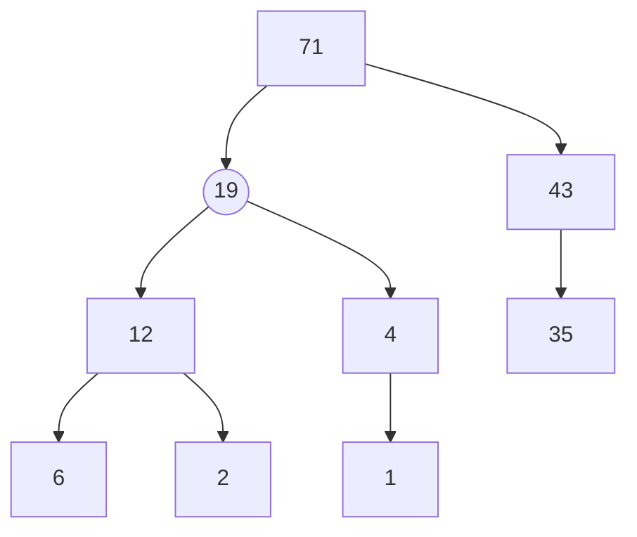
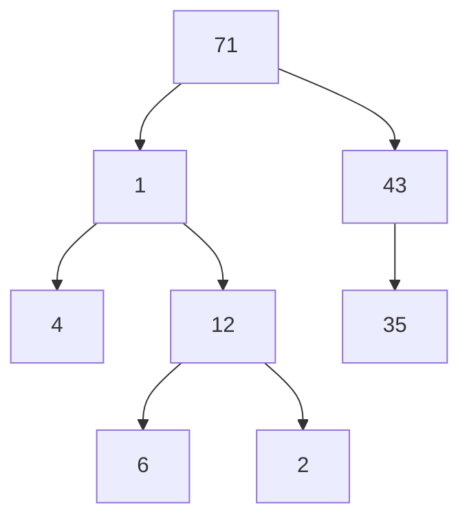
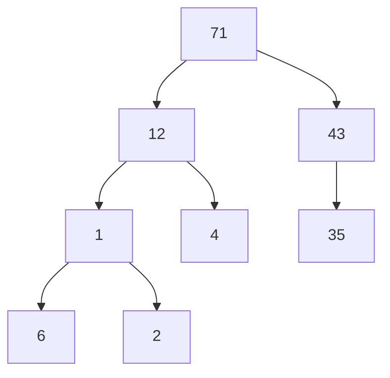
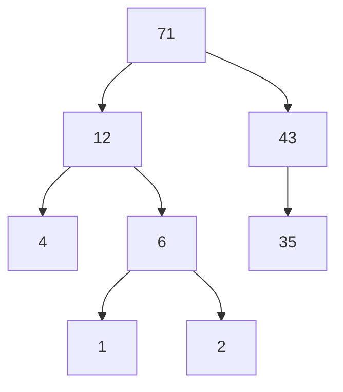

# Shrinking a Heap

Again follows the same properties mentioned in [[growing a heap]]. 

### Steps
1. Remove the desired node first, this would not follow the *Complete Binary Tree* property. 
2. To make sure we follow the *complete binary tree property* we need to add something at the position we removed the node. Only option is to add the last node. 
3. Now we are following the *complete binary tree* property but it might not follow *heap order* property.
4. `Heapify down` because we removed a node and swapped with the last node -> element we swapped to that position is definitely lesser than root node(map-heap).

[[add aliases to fish shell]]
---
## Related Notes
[[heaps]]
[[manipulating heaps]]
[[growing a heap]]

## References(links)
[Learning to Love Heaps. Today marks the halfway point of this… | by Vaidehi Joshi | basecs | Medium](https://medium.com/basecs/learning-to-love-heaps-cef2b273a238)

[For shrinking a heap, why do we need to remove the root node first and then...](https://www.perplexity.ai/search/for-shrinking-a-heap-why-do-we-LeuK2tAWTveZfE0D6EJfzg)