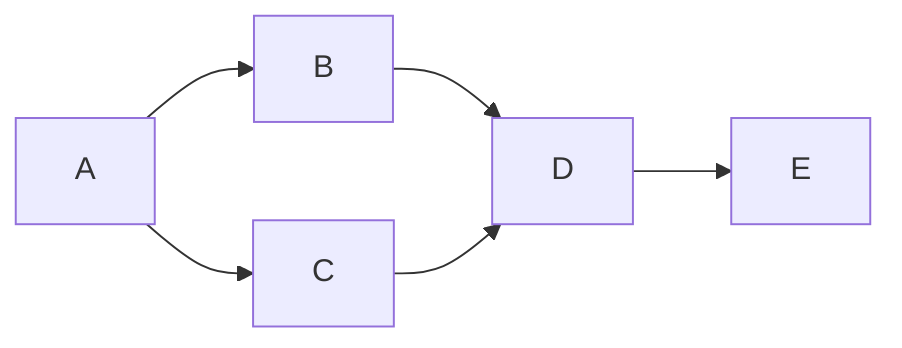

# topological sorting

Topological sorting is a way of ordering [[directed acyclic graphs]], which is quite important since [[directed acyclic graphs]] are used extensively and the ordering of the nodes is very important.

topological sorting just orders the vertices based on the interconnectedness of the edges. It makes sure that a vertex/node is only visited after all the vertices leading up to it is visited. *NOTE:* `Do not confuse with logic of topological sorting algorithm`

what the above statement means is that vertex `D` can only be visited after `B` and `C` vertices are visited. And the ==ordering is not exactly== unique because it only depends on whether the vertices leading up to a vertex are visited or not. 

topological ordering for above graph:
1. A - B - C - D - E
2. A - C - B - D - E

> [!note]-
> Topological sorting doesn't work for direct [[graphs]] with cycles, just think of it. 

There are two ways to implement it:
1. [[topological sorting using dfs]]
2. [[topological sorting using khan's algo]]

---
## Related Notes
[[graphs]]
[[directed acyclic graphs]]
[[topological sorting using dfs]]
[[topological sorting using khan's algo]]

## References(links)
[Spinning Around In Cycles With Directed Acyclic Graphs | by Vaidehi Joshi | basecs | Medium](https://medium.com/basecs/spinning-around-in-cycles-with-directed-acyclic-graphs-a233496d4688)